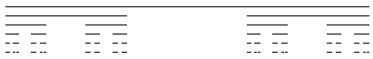

# cantor-set
A python script which uses a recursive function to visually generate a Cantor set.

## License
This script is availible under [The MIT License](https://opensource.org/licenses/MIT), see the `LICENSE` file for more information.
